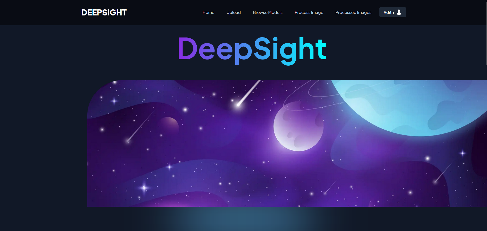
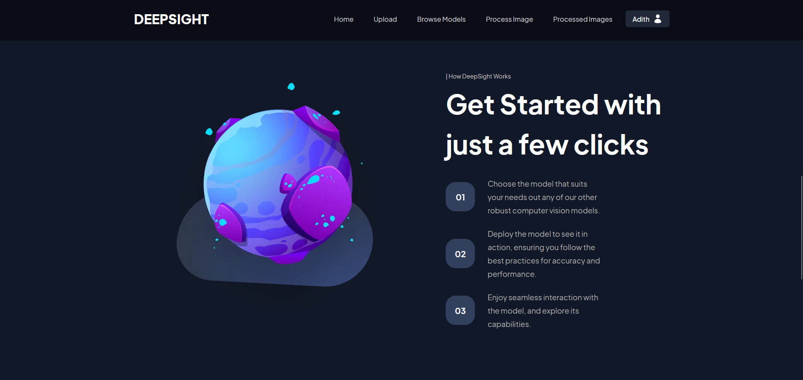
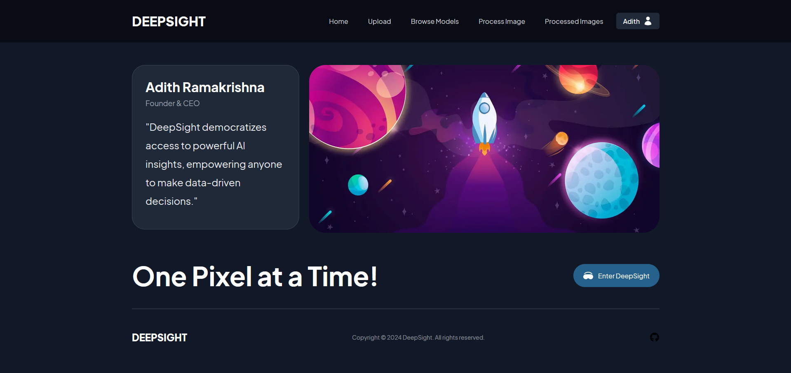
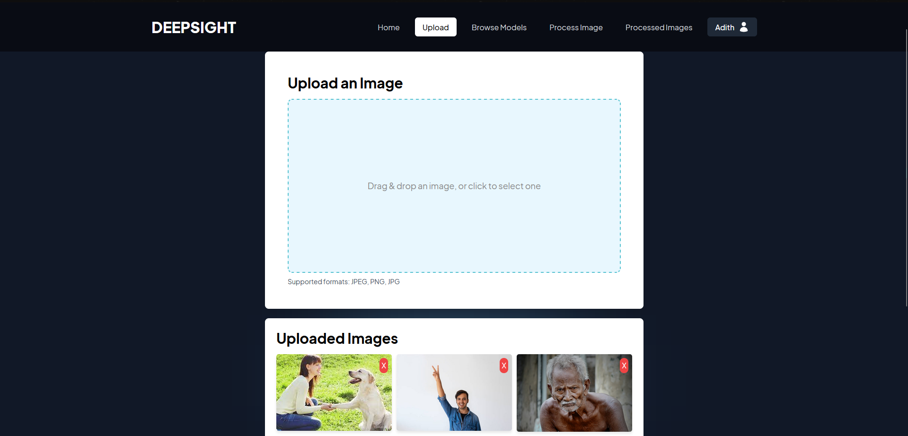
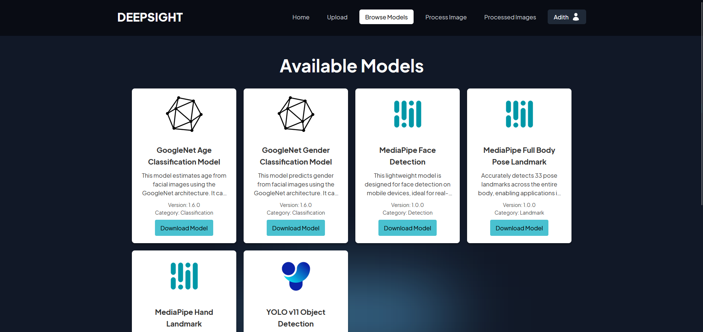
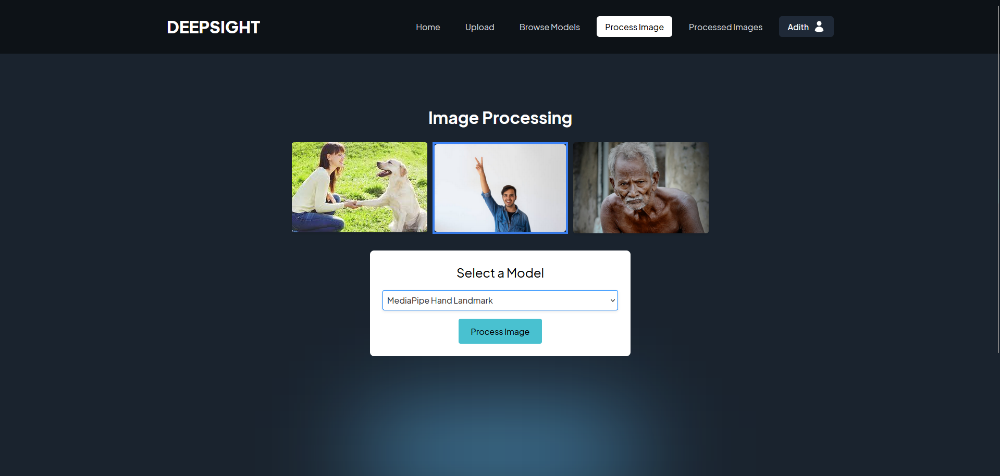
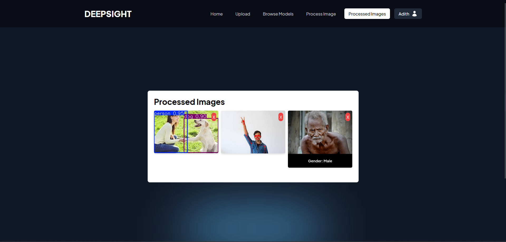
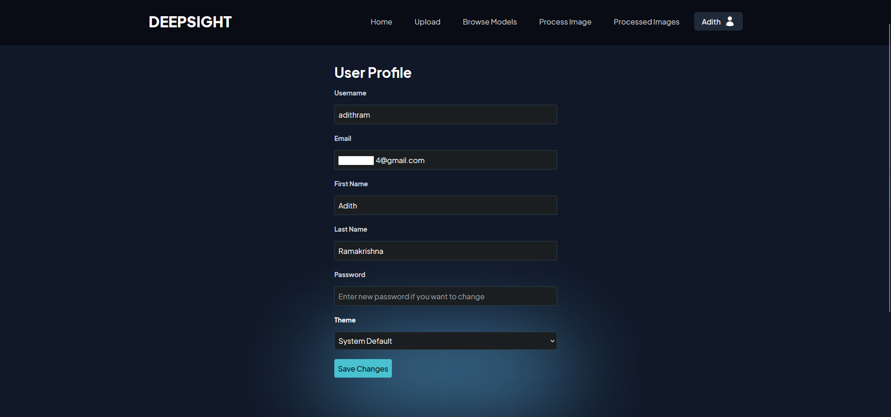

# DeepSight - Image Analysis Web Application

This project is a front-end application that allows users to upload images and run them through a pre-trained deep learning model to detect objects in the image. The application is built using Next.js, a React framework, and Django, a Python web framework.

## Instructions

```console
git clone https://github.com/ItsSpirax/DeepSight
cd DeepSight
```

Configure environment variables:

```console
cp .env.example .env
nano .env
```

Start the application:

```console
docker compose up -d
```

## Screenshots

Below are Screenshots showcasing the application:

* **Homepage Overview:** Overview of the application.
 [](https://app.fossa.com/projects/git%2Bgithub.com%2FItsSpirax%2FDeepSight?ref=badge_shield)
 
<br>

* **Get Started:** Introduction page to guide users on how to use the application.
  
<br>

* **Our Vision:** Shows the vision of the founders of the application.
  
<br>

* **Image Upload:** Page where users can upload images, view them, or delete them.
  
<br>

* **Available Models:** Displays the descriptions of different models available for image processing.
  
<br>

* **Process Selection:** Select an uploaded image and a model to run the image through.
  
<br>

* **Processed Images:** Shows all previously processed images.
  
<br>

* **User Profile:** Page for updating user details and password.
  
<br>

## Docker Images

The Docker images for the application can be found on Docker Hub:
* [Frontend](https://hub.docker.com/r/spirax/deepsight-frontend)
* [Backend](https://hub.docker.com/r/spirax/deepsight-backend)

## License

This project is licensed under the MIT License - see the [LICENSE.md](LICENSE.md) file for details.


[](https://app.fossa.com/projects/git%2Bgithub.com%2FItsSpirax%2FDeepSight?ref=badge_large)